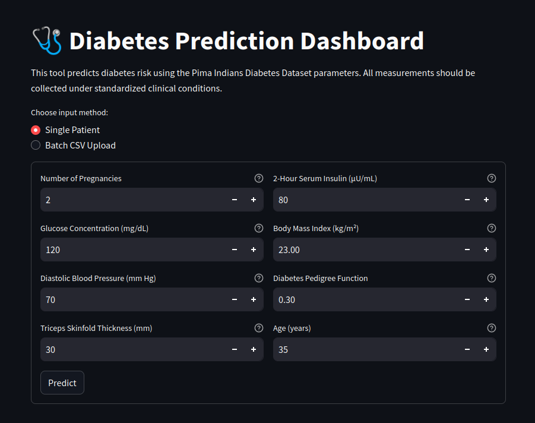
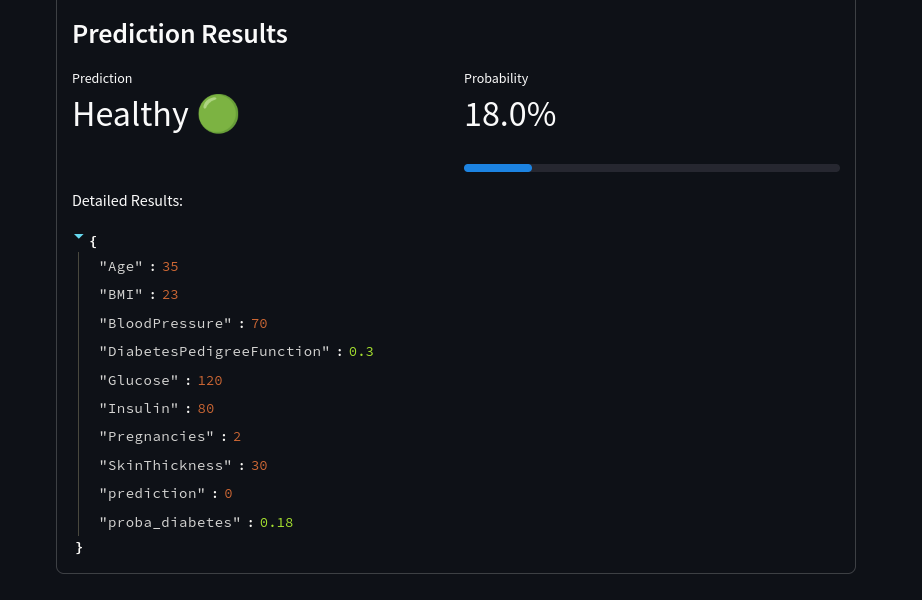

# MLOps project

This project aim to understand an MLOps pipeline for deploying a machine learning model in production on Google Cloud.




## Objectives
- Build a machine learning model
- Serialize the model
- Create an API for the model with Fast API
- Configure Google Cloud
- Containerize the application
- Build and deploy the container to Google Cloud Run

## Dataset
The dataset is from Kaggle : [Here](https://www.kaggle.com/datasets/uciml/pima-indians-diabetes-database/data)

> This dataset, contains data such as glucose level, blood pressure, insulin level, BMI, age, and whether the patient has diabetes or not.

## How

### 1. Build a machine learning model
I use a Random Forest Classifier to predict if a patient has diabetes or not,
indeed, the result is a binary classification. 

### 2. Serialize the model
I use the `joblib` library to serialize the model.
The model is saved as a .pkl file, which is a file format used for model serialization.

### 3. Create an API for the model with Flask
I use Flask to create an API for the model.

### 3.5 Test the API
```bash
curl -X POST http://127.0.0.1:5000/predict \
-H "Content-Type: application/json" \
-d '{
    "Pregnancies": 2,
    "Glucose": 120,
    "BloodPressure": 70,
    "SkinThickness": 20,
    "Insulin": 85,
    "BMI": 25.5,
    "DiabetesPedigreeFunction": 0.5,
    "Age": 30
}'
```
```json
{
    "result": {
        "Age": 30.0,
        "BMI": 25.5,
        "BloodPressure": 70.0,
        "DiabetesPedigreeFunction": 0.5,
        "Glucose": 120.0,
        "Insulin": 85.0,
        "Pregnancies": 2.0,
        "SkinThickness": 20.0,
        "prediction": 0,
        "proba_diabetes": 0.05
    }
}
```

### 4. Configure Google Cloud
I create a project on Google Cloud and enable the Cloud Run API and Artifact Registry API.

### 5. Containerize the application
I use Docker to containerize the application.
I use gcloud init, gcloud build submit to create the image and gcloud run deploy to deploy the container to Google Cloud Run.

### 6. Build and deploy the container to Google Cloud Run
I obtain this URL:
> https://mlops-app-675097283493.europe-west9.run.app/

### 7. I can test the API with the url, and I can create a streamlit app.
> Chatgpt create streamlit app easily, which can also be deployed on Google Cloud Run.

## Tech Stack
- Python
- Flask
- Docker
- Google Cloud

## GCP :
PROJECT_ID="deployement1-455002"
REGION="europe-west9"

gcloud builds submit --tag ${REGION}-docker.pkg.dev/${PROJECT_ID}/${REPO_NAME}/${IMAGE_NAME}:${IMAGE_TAG} .
gcloud run deploy --image ${REGION}-docker.pkg.dev/${PROJECT_ID}/${REPO_NAME}/${IMAGE_NAME}:${IMAGE_TAG} --platform managed --region ${REGION}